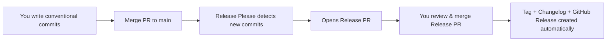

# Release Automation

## Purpose

This boilerplate uses **Release Please** — a GitHub Action that automates version bumps, changelog generation, and GitHub releases based on **Conventional Commits**.

This means you never have to think about version numbers or changelogs manually. Just write good commit messages, and the tool handles the rest.

If you're new to this workflow, start with the **Overview** section below. If something goes wrong, jump to **Troubleshooting**.

---

## How It Works — The Big Picture



That's it. Your job is just step 1 (write good commit messages) and step 5 (merge the release PR).

---

## Step 1: Write Conventional Commits

Every commit message should follow this format:

```
type(scope): short description
```

| Part            | Meaning               | Example                                         |
| --------------- | --------------------- | ----------------------------------------------- |
| **type**        | What kind of change   | `feat`, `fix`, `docs`, `refactor`, `test`, `ci` |
| **scope**       | (Optional) Which area | `auth`, `landing`, `proxy`, `docs`              |
| **description** | What changed          | "add sign out button to navbar"                 |

### Examples of Good Commit Messages

```
feat(landing): add auth-aware navbar with sign in/logout toggle
fix(auth): resolve redirect loop on login
docs(readme): update deployment instructions
refactor(proxy): simplify route protection logic
test(e2e): update home spec for new redirects
ci(release): add contributor avatars to release notes
```

### Types Map — How They Affect the Changelog

| Commit Type | Changelog Section | Version Bump          |
| ----------- | ----------------- | --------------------- |
| `feat`      | Features          | Minor (0.1.x → 0.2.0) |
| `fix`       | Bug Fixes         | Patch (0.1.1 → 0.1.2) |
| `perf`      | Performance       | Patch                 |
| `refactor`  | Refactoring       | Patch                 |
| `docs`      | Documentation     | Patch                 |
| `build`     | Build System      | Patch                 |
| `ci`        | CI                | Patch                 |
| `test`      | Tests             | Patch                 |
| `chore`     | Hidden            | No bump               |
| `style`     | Hidden            | No bump               |

---

## Step 2: Merge Your PR to `main`

Once your PR is approved and all status checks pass, merge it to `main` using **squash merge**.

The squash merge will combine all commits into one, and the PR title will become the commit message. So make sure your **PR title follows the conventional format** too.

> ✅ Good PR title: `feat(landing): add auth-aware navbar`
> ❌ Bad PR title: `fix stuff and update things`

---

## Step 3: Release Please Opens a Release PR

After your PR is merged, the `release-please.yml` workflow runs automatically. It:

1. Scans all commits since the last release
2. Groups them by type (`feat` → Features, `fix` → Bug Fixes, etc.)
3. Determines the next version number (based on the most significant change)
4. Creates or updates a **Release PR**

The Release PR looks like this:

```
Title:  chore(main): release 0.1.15
Branch: release-please--branches--main--components--next-js-boilerplate

Changes:
- Changelog updated with all merged commits
- Version bumped in package.json
- Tag ready to be created
```

---

## Step 4: Review and Merge the Release PR

This is the most important step. When you see the Release PR:

1. ✅ **Review the changelog** — Does it look correct? Are all the expected changes listed?
2. ✅ **Check the version bump** — Does it match what you expect? (`feat` → minor, `fix` → patch)
3. ✅ **Merge the PR** — Use **squash merge** or **merge commit**

Once merged, Release Please automatically:

- ✅ Creates a **Git tag** (`v0.1.15`)
- ✅ Creates a **GitHub Release** with the changelog text
- ✅ Updates `CHANGELOG.md` in the repository
- ✅ Appends **Credits**, **Contributors** (with avatars), and **Release Metadata** sections

---

## Rules — Do's and Don'ts

### ✅ Do

- ✅ Write conventional commit messages consistently
- ✅ Keep PR titles in conventional format (they become squash-merge commits)
- ✅ Let Release Please handle all tagging and versioning
- ✅ If you need to fix something after a release, just merge another PR — Release Please will bump again

### ❌ Don't

- ❌ **Don't create release tags manually** — This confuses Release Please and can cause duplicate entries
- ❌ **Don't hand-edit the generated release PR body** — Your edits will be overwritten if the PR updates
- ❌ **Don't directly edit CHANGELOG.md** — Let Release Please manage it
- ❌ **Don't include multiple unrelated changes in one commit** — The changelog will be harder to read

---

## Troubleshooting

### Changelog item is missing

**Possible causes:**

- Commit message didn't follow conventional format — check the merge commit message
- Commit type might be one that's hidden (`chore`, `style`)
- The commit was pushed directly to `main` without going through the release PR

**Fix:**

- Make sure all future commits follow the conventional format
- If a change is already merged, it'll be picked up in the next release

### Duplicate release tag / release entry

**Possible causes:**

- Someone created a tag manually
- The workflow ran twice for the same release

**Fix:**

1. Go to **Releases** → delete the duplicate release
2. Go to **Actions** → re-run the `release-please` workflow
3. Go to **Tags** → delete the duplicate tag (`git push origin --delete v0.1.x`)

### Release PR isn't opening

**Possible causes:**

- Workflow permissions aren't configured correctly
- `.release-please-config.json` or `release-please-manifest.json` is misconfigured
- No new conventional commits since the last release

**Fix:**

- Check **Settings** → **Actions** → **General** → Workflow permissions → **Read and write permissions**
- Verify the config files are valid JSON
- Check if there are actually new commits since the last tag

### Version number is wrong

**Possible causes:**

- A `feat:` commit was included when you expected only `fix:` commits
- `bump-minor-pre-major` is set to `true` (which is intentional — it bumps minor for features even before v1.0)

**Fix:**

- Review the commits between releases to understand what caused the bump
- If needed, you can manually override by editing the release, but it's usually not necessary

### Failure: "Could not compute contributor list"

This is a non-fatal warning. The release will still be created, but the Contributors section will say "No external contributors detected." This can happen if the tag comparison fails (e.g., the previous tag was deleted).
