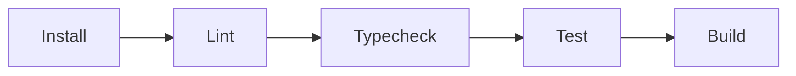

# Workflows

## Purpose

This boilerplate includes **17 GitHub Actions workflows** that automate CI, PR governance, security scanning, and release management. This document explains what each workflow does and when it runs.

---

## CI & Quality

These workflows run on every push and pull request to ensure code quality.

### `ci.yml` — Main CI Pipeline

**Triggers:** Push to any branch, PR to `main`

This is the primary quality gate. It runs:



| Step      | Command                          | What It Checks                     |
| --------- | -------------------------------- | ---------------------------------- |
| Install   | `pnpm install --frozen-lockfile` | Lockfile is up to date             |
| Lint      | `pnpm run lint`                  | Code follows ESLint rules          |
| Typecheck | `pnpm run typecheck`             | TypeScript compiles without errors |
| Test      | `pnpm run test`                  | All unit & integration tests pass  |
| Build     | `pnpm run build`                 | Production build succeeds          |

**Required to pass before merge** ✅

### `package-manager-consistency.yml` — Lockfile Check

**Triggers:** PR to `main`

Verifies that the lockfile (`pnpm-lock.yaml`) matches `package.json`. Prevents dependency drift.

### `bun-compatibility.yml` — Bun Compatibility

**Triggers:** PR to `main`

Verifies the project can also install with `bun`. A non-blocking check — if it fails, it doesn't block merge.

---

## PR Governance

These workflows enforce conventions on pull requests.

### `commitlint.yml` — Commit Message Validation

**Triggers:** PR to `main`

Validates that **every commit** in the PR follows [Conventional Commits](https://www.conventionalcommits.org/):

```
type(scope): description
```

Allowed types: `feat`, `fix`, `docs`, `refactor`, `perf`, `test`, `ci`, `build`, `chore`, `style`

> **Why it matters:** Conventional commits are used by Release Please to generate changelogs and determine version bumps. Invalid commits won't appear in the changelog.

### `pr-title.yml` — PR Title Validation

**Triggers:** PR opened or edited

Validates the PR title follows the same Conventional Commit format. Since PRs are typically **squash-merged**, the PR title becomes the final commit message.

✅ Good: `feat(landing): add hero section with icons`
❌ Bad: `Update landing page`

### `labeler.yml` — Auto Labeling

**Triggers:** PR to `main`

Automatically adds labels based on which files were changed:

| Changed Path | Label Applied       |
| ------------ | ------------------- |
| `src/**`     | Source code related |
| `docs/**`    | Documentation       |
| `.github/**` | CI / DevOps         |
| `drizzle/**` | Database            |

### `pr-auto-merge.yml` — Auto Merge (Optional)

**Triggers:** PR opened

Automatically merges PRs that meet all criteria. Used for trusted automations (dependabot) or minor changes.

---

## Security & Dependency

These workflows scan for vulnerabilities and enforce security policies.

### `codeql.yml` — CodeQL Static Analysis

**Triggers:** Push to `main`, scheduled weekly

GitHub's built-in security analysis. Scans the entire codebase for:

- SQL injection
- Cross-site scripting (XSS)
- Path traversal
- Hardcoded credentials
- And many other vulnerability patterns

### `codehawk.yml` — CodeHawk Security Scan

**Triggers:** PR to `main`

An additional security scan that checks for:

- Secrets in code
- Vulnerable dependency usage
- Code quality issues

### `dependency-review.yml` — Dependency Review

**Triggers:** PR to `main`

When a PR adds or updates dependencies, this workflow:

1. Reviews the diff of `package.json` and lockfile
2. Checks new dependencies against known vulnerability databases
3. Flags any packages with CVEs or security warnings

**Blocks merge if vulnerabilities are found** ⛔

### `dependabot-auto-merge.yml` — Safe Auto-Merge for Dependabot

**Triggers:** Dependabot PR opened

Automatically merges dependency update PRs from Dependabot if:

- ✅ The update is a **patch** version (safe bug fix)
- ✅ All CI checks pass
- ✅ The `dependency-review` workflow passes

---

## Release & Maintenance

### `release-please.yml` — Automated Releases

**Triggers:** Push to `main`

This is the most important automation. It:

1. **Scans commits** since the last release
2. **Determines version bump** based on commit types
3. **Opens/updates a Release PR** with changelog
4. When merged → **creates tag + GitHub release** with:
   - Full changelog organized by type
   - Credits section
   - Contributors section (with avatars)
   - Release metadata

The release title is the git tag (e.g., `v0.1.15`).

> For full details, see the [Release Automation](docs/guides/release-automation.md) guide.

### `stale.yml` — Stale Issue/PR Cleanup

**Triggers:** Scheduled (daily)

Manages stale issues and pull requests:

| Condition                           | Action               |
| ----------------------------------- | -------------------- |
| No activity for 60 days             | Labeled `stale`      |
| Stale for 7 more days (no response) | Closed automatically |
| Any activity removes stale label    | Kept open            |

Helps keep the issue tracker clean and focused.

---

## Suggested Local Preflight

Before pushing major changes, run these same checks locally:

```bash
pnpm run lint
pnpm run typecheck
pnpm run test
pnpm run build
```

This catches most CI failures before they reach GitHub.

---

## Workflow Reference Table

| Workflow                          | Category      | Triggers       | Blocks Merge?      |
| --------------------------------- | ------------- | -------------- | ------------------ |
| `ci.yml`                          | CI & Quality  | Push, PR       | ✅                 |
| `package-manager-consistency.yml` | CI & Quality  | PR             | ✅                 |
| `bun-compatibility.yml`           | CI & Quality  | PR             | ❌ (informational) |
| `commitlint.yml`                  | PR Governance | PR             | ✅                 |
| `pr-title.yml`                    | PR Governance | PR opened      | ✅                 |
| `labeler.yml`                     | PR Governance | PR             | ❌ (auto-label)    |
| `pr-auto-merge.yml`               | PR Governance | PR optional    | ❌ (auto action)   |
| `codeql.yml`                      | Security      | Push, weekly   | ❌ (advisory)      |
| `codehawk.yml`                    | Security      | PR             | ❌ (advisory)      |
| `dependency-review.yml`           | Security      | PR             | ✅                 |
| `dependabot-auto-merge.yml`       | Security      | Dependabot PR  | ❌ (auto action)   |
| `release-please.yml`              | Release       | Push to main   | ❌ (auto action)   |
| `stale.yml`                       | Maintenance   | Daily schedule | ❌ (auto action)   |

---

## Related Docs

- [Release Automation](docs/guides/release-automation.md) — Deep dive into the release workflow
- [GitHub Setup Checklist](docs/guides/github-setup-checklist.md) — Required checks, permissions, secrets
